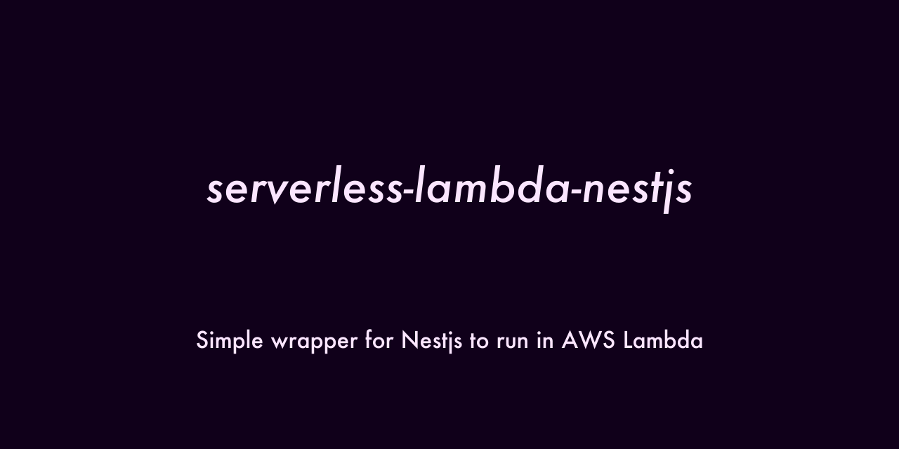
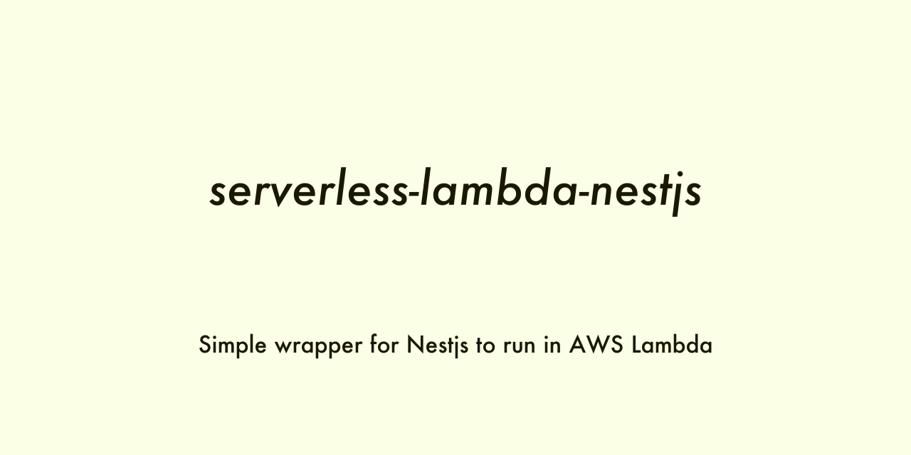

# Serverless AWS Lambda Nestjs Adapter

## Badges

[](https://nodei.co/npm/serverless-lambda-nestjs/)  
[](https://badge.fury.io/js/serverless-lambda-nestjs)
[](https://opensource.org/licenses/MIT)
[](https://codeclimate.com/github/hideokamoto/serverless-lambda-nestjs/maintainability)
[](https://codeclimate.com/github/hideokamoto/serverless-lambda-nestjs/test_coverage)
[](https://travis-ci.org/hideokamoto/serverless-lambda-nestjs)
[](https://app.fossa.com/projects/git%2Bgithub.com%2Fwpkyoto%2Fserverless-lambda-nestjs?ref=badge_small)

## Usage

Add it into your Nestjs with AWS Lambda application

```bash
$ npm install -S serverless-lambda-nestjs
```

Wrap your Nestjs application by the package.

```typescript
import { APIGatewayProxyHandler } from 'aws-lambda';
import { ServerlessNestjsApplicationFactory } from 'serverless-lambda-nestjs';
// YOUR Nestjs application root module
import { AppModule } from './app.module';

export const handler: APIGatewayProxyHandler = async (event, context) => {
  const app = new ServerlessNestjsApplicationFactory<AppModule>(
    AppModule,
  );
  const result = await app.run(event, context);
  return result;
};


export const handler: APIGatewayProxyHandler = async (event, context) => {
  const app = new ServerlessNestjsApplicationFactory<AppModule>(
    AppModule,
    {
        // NestFactory.create's option object
        cors: true,
    },
    app => {
      // Call additional API from NestFactory.create result
      app.enableCors();
      return app;
    },
  );
  const result = await app.run(event, context);
  return result;
};
```


## OGP

```bash
// both
$ yarn run create:ogp

// dark
$ yarn run create:ogp:dark

// light
$ yarn run create:ogp:light
```
  


## Prepare

```
$ git clone git@github.com:hideokamoto/serverless-lambda-nestjs.git
$ cd serverless-lambda-nestjs

// Put your GitHub Personal Access Token
$ mv .envrc.example .envrc
$ vim .envrc
export CONVENTIONAL_GITHUB_RELEASER_TOKEN=PUT_YOUR_GITHUB_ACCESS_TOKEN

// Install
$ yarn
or
$ npm install
```

### GitHub Personal Access Token Scope

If the project is private -> `repo`
If the project is public -> `public_repo`

## Commit message rule

The repository runs commitlint.
We have to follow "Conventional Commit" to make a commit message.

https://www.conventionalcommits.org/en/v1.0.0-beta.4/

```bash
$ git commit -m "<type>[optional scope]: <description>

[optional body]

[optional footer]"
```

## Contribution

```bash
// clone
$ git clone git@github.com:hideokamoto/serverless-lambda-nestjs.git
$ cd serverless-lambda-nestjs

// setup
$ yarn

// Unit test
$ yarn test
or
$ yarn run test:watch

// Lint
$ yarn run lint
or
$ yarn run lint --fix

// Build
$ yarn run build

// Rebuild docs
$ yarn run doc
```
